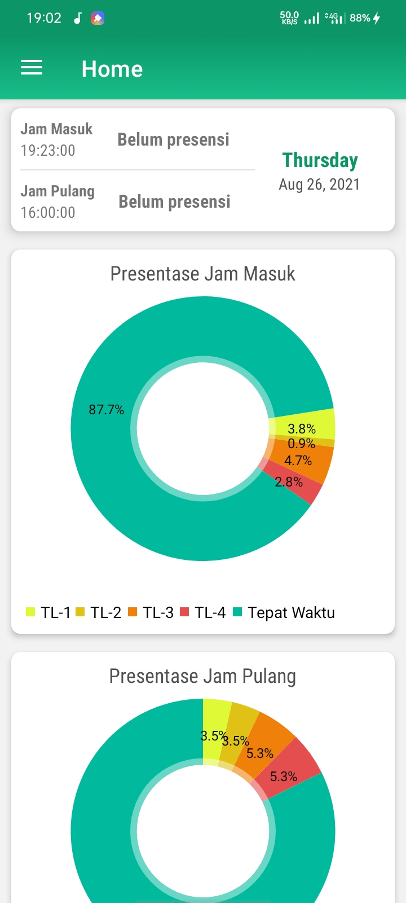
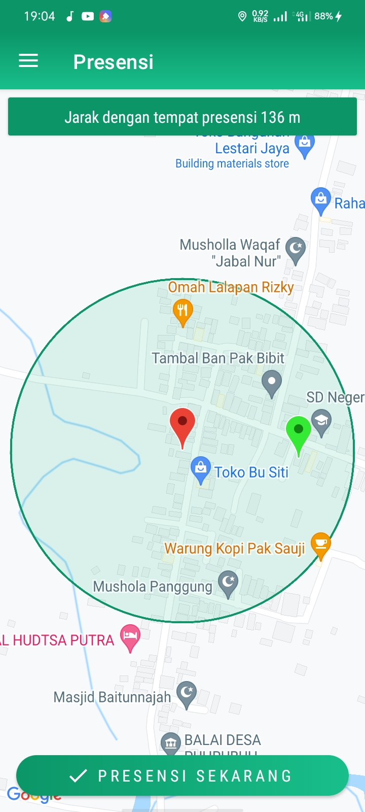

## Usage Application
> To do attendance employee

## Screenshots

  
  
  

## Application Features
- Login
- Geofencing to draw radius employee when do attendance
- Attendance with check in and check out
- Check out only do at 12pm more
- Submit absence
- Filter attendance by range date
- Get notification for attendance
- Recap pdf attendance

## Language & Libraries
- Kotlin (as programming language)
- Android Volley
- Hdodenhof CircleImageView
- Squareup Picasso
- Itextpdf 7
- MPAndroidChart